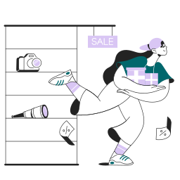
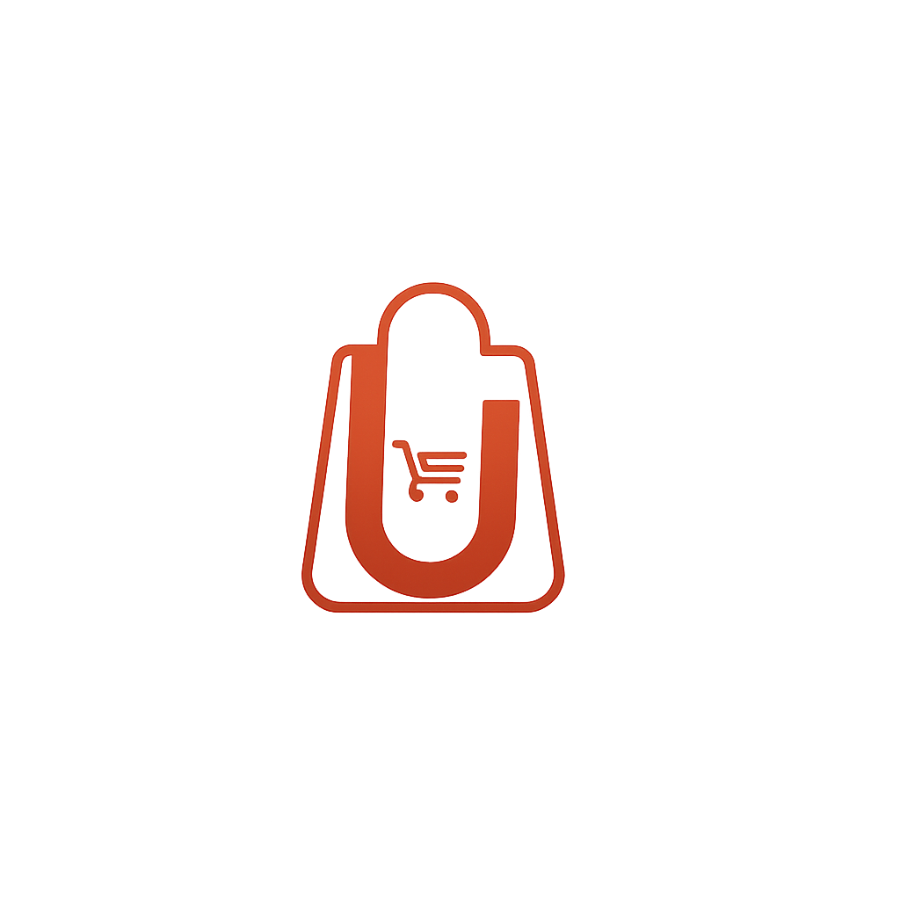

<p align="center">
  
</p>

<h1 align="center">Ushopia</h1>

<p align="center">
  <b>A robust, scalable, and beautiful e-commerce solution built with Flutter.</b>
</p>

<p align="center">
  
  
  
</p>

---

## Features

- Modern e-commerce UI/UX
- Secure authentication
- Product catalog with categories & brands
- Cart & checkout flow
- Multiple payment methods
- Order tracking
- Light & dark mode support
- Responsive design (mobile, tablet, web)
- Rich product images & banners

---

## Screenshots

<p align="center">
  
  
  
</p>

---

## Getting Started

### 1 Prerequisites

- [Flutter SDK](https://flutter.dev/docs/get-started/install)
- Dart SDK (>=3.0.5 <4.0.0)
- Android Studio / VS Code / Xcode

### 2 Installation

```sh
git clone https://github.com/yourusername/ushopia.git
cd ushopia
flutter pub get
```

### 3 Running the App

```sh
flutter run
```

---

## Configuration

- **Splash Screen:** Configured via [`splash.yaml`](splash.yaml)
- **Assets:** All images and icons are in the [`assets/`](assets/) directory.
- **Image References:** Managed in [`lib/utils/constants/image_strings.dart`](lib/utils/constants/image_strings.dart)

---

## Brand & Payment Icons

<p>
  
  
  
  
  
  
</p>

---

## Project Structure

```
lib/
  ├── main.dart
  ├── utils/
  │    └── constants/
  │         └── image_strings.dart
  ├── models/
  ├── views/
  ├── controllers/
  ├── widgets/
  └── ...
assets/
  ├── images/
  ├── logos/
  ├── icons/
  ├── fonts/
  └── ...
```

---

## Contributing

We welcome contributions! Please open issues or submit pull requests for improvements and bug fixes.

---

## License

This project is licensed under the MIT License.

---

<p align="center">
  
</p>
